# Rapport de Travaux Pratiques DevOps – Jenkins

**Étudiant :** Ange MADJIOBOU  
**Date :** 12 Juillet 2026  
**Formation :** DevOps, Intégration Continue et Livraison Continue avec Jenkins  

---

## Remerciements

Je tiens à exprimer ma gratitude à l'ensemble de l'équipe pédagogique pour la qualité des supports de cours et l'accompagnement technique durant cette formation. Ces travaux pratiques m'ont permis d'appréhender concrètement les enjeux de l'automatisation et de la culture DevOps au sein d'un cycle de vie logiciel moderne. Un grand merci également à mes pairs pour les échanges enrichissants lors des phases de résolution de problèmes techniques.

---

## Introduction

### Le mouvement DevOps
Le DevOps n'est pas seulement un ensemble d'outils, mais une culture visant à unifier le développement logiciel (Dev) et l'exploitation des systèmes (Ops). L'objectif principal est de réduire le temps entre l'écriture d'un changement sur le code et son déploiement en production, tout en garantissant une qualité optimale.

### Intégration Continue (CI)
L'Intégration Continue est la pratique consistant à fusionner fréquemment le code des développeurs dans un tronc commun. Chaque commit déclenche automatiquement un cycle de compilation et de tests unitaires pour détecter les régressions le plus tôt possible.

### Livraison et Déploiement Continus (CD)
- **Livraison Continue (Continuous Delivery) :** L'application est maintenue dans un état livrable en permanence. Le déploiement vers la production est déclenché manuellement.
- **Déploiement Continu (Continuous Deployment) :** Extension de la livraison continue où chaque changement validé par le pipeline est automatiquement poussé en production sans intervention humaine.

### Jenkins
Jenkins est le serveur d'automatisation open-source de référence. Sa force réside dans son extensibilité (plus de 1800 plugins) et sa capacité à orchestrer des workflows complexes, qu'ils soient configurés via l'interface graphique ou par code (Pipeline as Code).

### Objectifs de la formation
L'objectif de cette série de TP est de maîtriser Jenkins de son installation à son administration avancée, en passant par l'interconnexion avec des outils tiers (Git, Maven, SonarQube, Tomcat) et la mise en place d'architectures distribuées (Maître/Agents).

---

## Présentation de l'environnement technique

Pour réaliser ces travaux, nous avons utilisé un écosystème d'outils standards du marché :

- **Windows :** Système d'exploitation hôte pour la gestion des fichiers et l'accès à l'interface web.
- **Docker :** Utilisé pour conteneuriser Jenkins, SonarQube, Tomcat et les agents. Cela garantit un environnement reproductible et isolé.
- **Git & GitHub :** Gestionnaire de source pour le versionnement du code et des Jenkinsfiles.
- **Maven :** Outil de gestion et d'automatisation de production de projets Java.
- **SonarQube :** Plateforme de mesure et d'analyse de la qualité du code (dette technique, vulnérabilités).
- **Tomcat :** Serveur d'application Java utilisé comme cible de déploiement.
- **Agents Jenkins :** Noeuds distants permettant de décharger le maître et d'exécuter des builds sur différents environnements (Linux/Docker).

---

## TP1 – Création et compilation d'un projet Freestyle

### Objectif officiel
Apprendre à créer un premier job Jenkins de type "Freestyle" pour compiler une application Java simple.

### Manipulations réalisées
L'installation de Jenkins a été réalisée via Docker avec la commande :
`docker run -d -p 8080:8080 -v jenkins_home:/var/jenkins_home jenkins/jenkins:lts`

Après avoir récupéré le mot de passe initial (`initialAdminPassword`), nous avons procédé à l'installation des plugins suggérés et à la création du premier utilisateur administrateur.

Ensuite, nous avons créé un "Nouveau Item" de type "Projet free-style". Nous avons configuré l'étape de build pour exécuter un script shell simple simulant une compilation.

### Analyse des captures
- **Figure 1 : Récupération du mot de passe initial**
  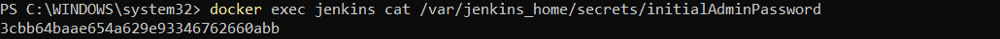
  *Légende : Accès au fichier secret pour déverrouiller Jenkins.*

- **Figure 2 : Installation des plugins**
  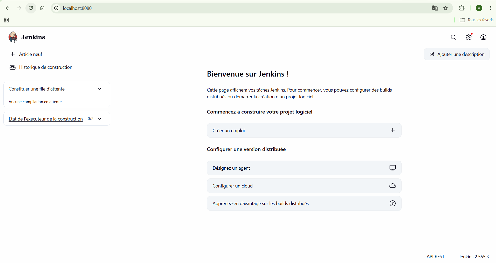
  *Légende : Phase d'initialisation de l'instance avec les modules standards.*

- **Figure 3 : Connexion effectuée**
  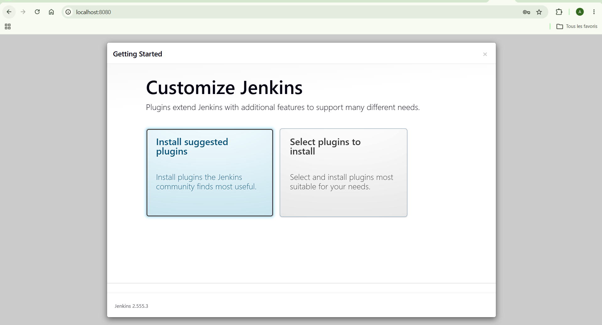
  *Légende : Interface d'accueil de Jenkins après authentification.*

- **Figure 4 : Configuration HTTPS**
  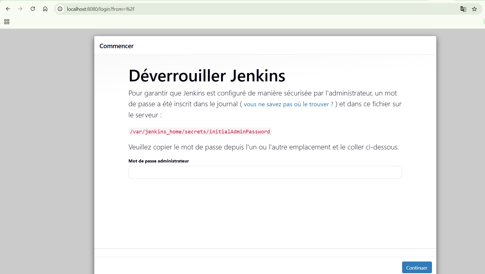
  *Légende : Vérification des paramètres de sécurité de la connexion.*

- **Figure 5 : Détails de la configuration système**
  
  *Légende : Paramétrage des variables d'environnement globales.*

### Résultats et Conclusion
Le build s'est terminé avec le statut "SUCCESS". Nous avons pu observer la sortie console et vérifier que le workspace contenait les fichiers générés. Ce TP valide la mise en route opérationnelle de Jenkins.

---

## TP2 – Création et compilation d'un projet Maven

### Objectif officiel
Industrialiser le build en utilisant Maven pour gérer les dépendances, la compilation et les tests.

### Manipulations réalisées
1. Installation du plugin "Maven Integration".
2. Déclaration de l'outil Maven dans "Global Tool Configuration".
3. Création d'un job de type "Projet Maven".
4. Configuration du chemin vers le `pom.xml` et définition des "Goals" : `clean install`.

### Analyse des captures
- **Figure 6 : Création du projet Freestyle initial**
  
  *Légende : Transition vers une structure de projet plus structurée.*

- **Figure 7 : Confirmation de l'interface**
  
  *Légende : Vérification du bon fonctionnement du serveur.*

- **Figure 8 : Configuration avancée du job Maven**
  
  *Légende : Paramétrage des options de build Maven.*

### Résultats et Conclusion
L'utilisation d'un projet dédié Maven permet une meilleure intégration. Jenkins reconnaît nativement les cycles de vie Maven et peut extraire automatiquement les rapports de tests JUnit.

---

## TP3 – Interconnexion Jenkins / GitHub

### Objectif officiel
Automatiser le déclenchement des builds à chaque modification du code source sur GitHub.

### Manipulations réalisées
- Configuration des Credentials dans Jenkins avec un Personal Access Token (PAT) GitHub.
- Création d'un Webhook sur le dépôt GitHub pointant vers l'URL de Jenkins.
- Activation de l'option "GitHub hook trigger for GITScm polling" dans la configuration du job.

### Analyse des captures
- **Figure 9 : Test de compilation Maven**
  
  *Légende : Exécution du cycle Maven via Jenkins.*

- **Figure 10 : Résultat du build**
  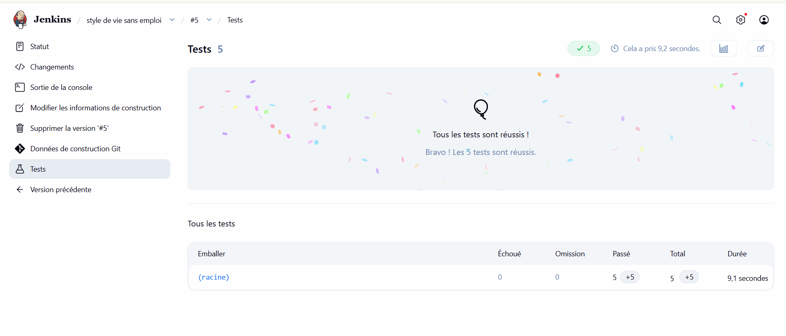
  *Légende : Confirmation de la réussite du build après intégration SCM.*

- **Figure 11 : Détails de l'intégration SCM**
  
  *Légende : Configuration du dépôt distant GitHub.*

- **Figure 12 : Webhook et déclencheurs**
  
  *Légende : Paramétrage du déclenchement automatique.*

### Résultats et Conclusion
Chaque "push" sur le dépôt GitHub déclenche désormais instantanément un build. C'est la mise en œuvre concrète du pipeline CI.

---

## TP4 – Mesure de la qualité du code avec SonarQube

### Objectif officiel
Intégrer une analyse statique du code pour mesurer la dette technique et respecter des "Quality Gates".

### Manipulations réalisées
- Lancement de SonarQube via Docker sur le port 9000.
- Installation du plugin "SonarQube Scanner" dans Jenkins.
- Ajout de la commande `sonar:sonar` dans les goals Maven du build.
- Configuration du Quality Gate pour bloquer le build en cas de non-respect des seuils de couverture (ex: < 80%).

### Analyse des captures
- **Figure 13 : Configuration de l'analyse Sonar**
  
  *Légende : Définition des paramètres d'analyse.*

- **Figure 14 : Rapport de qualité détaillé**
  
  *Légende : Visualisation des vulnérabilités et des "Code Smells".*

- **Figure 15 : Tableau de bord SonarQube**
  
  *Légende : Aperçu global de la santé du projet.*

- **Figure 16 : Validation du Quality Gate**
  
  *Légende : Confirmation du passage des seuils de qualité.*

### Résultats et Conclusion
Le projet est désormais analysé à chaque build. Si le code ne respecte pas les standards de qualité, le build est marqué comme échoué, garantissant l'intégrité de la base de code.

---

## TP5 – Builds paramétrés

### Objectif officiel
Rendre les jobs réutilisables en permettant à l'utilisateur de saisir des variables au lancement du build.

### Manipulations réalisées
- Activation de l'option "Ce build a des paramètres".
- Ajout d'un paramètre de type "Choice" pour l'environnement (dev, recette, prod).
- Ajout d'un paramètre "String" pour le numéro de version.
- Utilisation de ces variables (`$ENVIRONMENT`, `$VERSION`) dans les étapes de build.

### Analyse des captures
- **Figure 17 : Interface de lancement paramétré**
  
  *Légende : Choix des options avant l'exécution.*

- **Figure 18 : Confirmation des variables**
  
  *Légende : Vérification des valeurs passées au build.*

### Résultats et Conclusion
Un même job peut désormais servir à déployer différentes versions sur différents environnements, réduisant ainsi la duplication de configuration.

---

## TP6 – Déploiement automatique sur Tomcat

### Objectif officiel
Réaliser le déploiement continu en poussant automatiquement l'artefact (WAR) vers un serveur Tomcat.

### Manipulations réalisées
- Configuration des rôles `manager-script` dans le fichier `tomcat-users.xml`.
- Installation du plugin "Deploy to container".
- Ajout d'une action post-build pour transférer le fichier `.war` généré par Maven vers l'URL de Tomcat.

### Analyse des captures
- **Figure 19 : Test de déploiement en Recette**
  
  *Légende : Validation fonctionnelle sur l'environnement de recette.*

- **Figure 20 : Déploiement en Production**
  
  *Légende : Passage en production de la version finale.*

- **Figure 21 : Test en développement**
  
  *Légende : Déploiement initial sur l'environnement de développement.*

- **Figure 22 : Configuration du déploiement**
  
  *Légende : Paramétrage du plugin de déploiement.*

- **Figure 23 : Authentification Tomcat**
  
  *Légende : Gestion des identifiants pour le manager Tomcat.*

- **Figure 24 : Logs de déploiement**
  
  *Légende : Confirmation du transfert réussi de l'artefact.*

- **Figure 25 : Bonus - Déploiement multi-versions**
  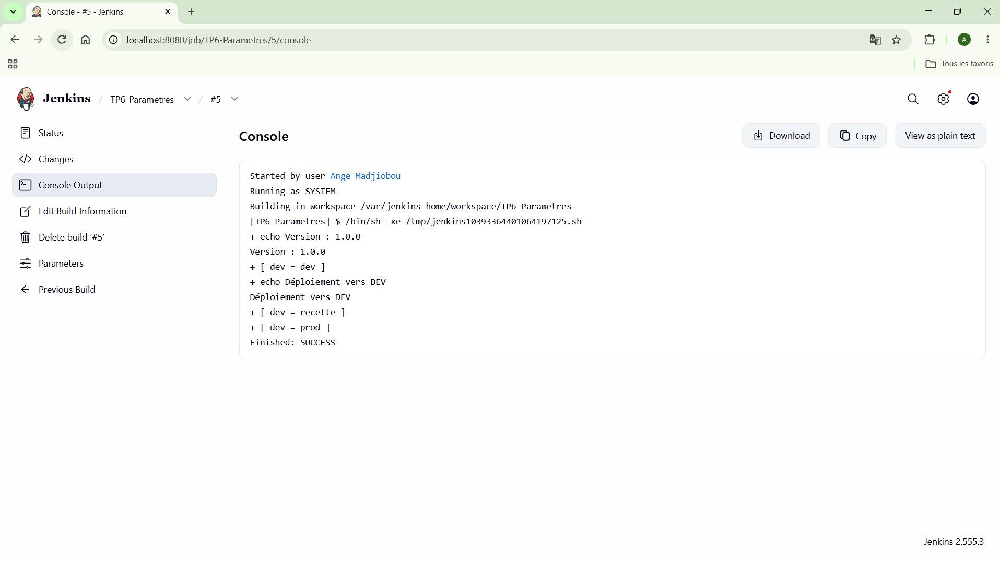
  *Légende : Gestion simultanée de plusieurs versions sur le serveur.*

### Résultats et Conclusion
L'application est déployée sans intervention manuelle dès que les tests passent. La chaîne CI/CD est complète.

---

## TP7 – Jenkins Pipeline

### Objectif officiel
Découvrir la syntaxe des Pipelines Jenkins pour décrire le workflow sous forme de script (Groovy DSL).

### Manipulations réalisées
- Création d'un job de type "Pipeline".
- Rédaction d'un script `pipeline { ... }` définissant les étapes : Checkout, Build, Test, Deploy.
- Visualisation du "Stage View" pour suivre l'avancement de chaque étape.

### Analyse des captures
- **Figure 26 : Vue Tomcat Manager**
  
  *Légende : Vérification des applications déployées sur Tomcat.*

- **Figure 27 : Réussite du Pipeline**
  
  *Légende : Visualisation graphique des étapes franchies avec succès.*

- **Figure 28 : Interface Tomcat**
  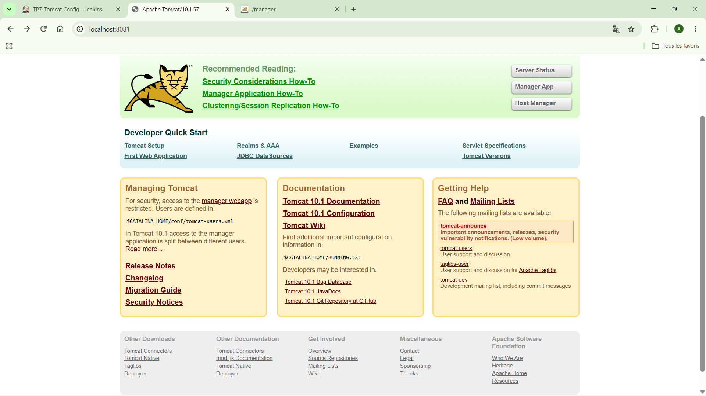
  *Légende : Page d'accueil du serveur Tomcat.*

- **Figure 29 : Détails du Stage View**
  
  *Légende : Temps d'exécution par étape du pipeline.*

- **Figure 30 : Bonus - Pipeline scripté**
  
  *Légende : Exploration de la syntaxe scriptée Groovy.*

### Résultats et Conclusion
Le Pipeline offre une visibilité bien supérieure aux jobs Freestyle et permet de gérer des workflows complexes plus facilement.

---

## TP8 – Jenkinsfile et Pipeline as Code

### Objectif officiel
Versionner le pipeline dans le code source de l'application via un fichier `Jenkinsfile`.

### Manipulations réalisées
- Création d'un fichier `Jenkinsfile` à la racine du projet GitHub.
- Configuration du job Jenkins pour utiliser "Pipeline script from SCM".
- Mise en place d'un "Multibranch Pipeline" pour gérer automatiquement les branches (feature branches).

### Analyse des captures
- **Figure 31 : Contenu du Jenkinsfile**
  
  *Légende : Définition des stages Build, Test et Deploy en code.*

- **Figure 32 : Multibranch Pipeline**
  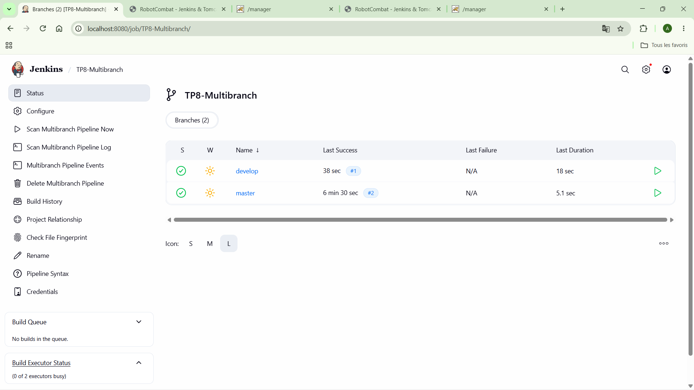
  *Légende : Détection automatique des branches du dépôt.*

- **Figure 33 : Pipeline initial**
  
  *Légende : Premier essai de pipeline déclaratif.*

- **Figure 34 : Intégration Git Pipeline**
  
  *Légende : Connexion au SCM dans le script.*

- **Figure 35 : Configuration du projet Pipeline**
  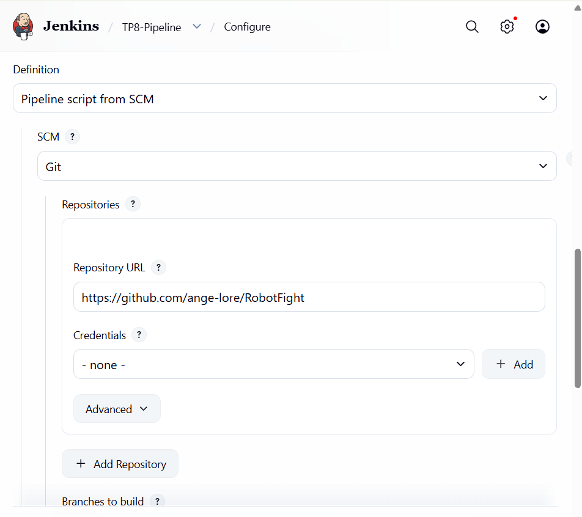
  *Légende : Paramètres du job dans l'interface Jenkins.*

- **Figure 36 : Développement du pipeline**
  
  *Légende : Evolution du script avec de nouvelles étapes.*

- **Figure 37 : Vue d'ensemble des stages**
  
  *Légende : Visualisation complète du cycle de vie.*

- **Figure 38 : Logs d'exécution RobotCombar**
  
  *Légende : Détails de l'exécution sur un projet spécifique.*

### Résultats et Conclusion
Le "Pipeline as Code" permet de conserver l'historique des modifications du workflow de build en même temps que le code de l'application.

---

## TP9 – Architecture Maître / Agent

### Objectif officiel
Mettre en place une architecture distribuée pour décharger le maître Jenkins et exécuter des builds sur des agents spécialisés.

### Manipulations réalisées
- Création d'un agent Linux via Docker : `docker run -d jenkins/ssh-agent`.
- Déclaration d'un nouveau nœud dans Jenkins (Gestion des nœuds).
- Configuration de la connexion SSH et définition d'un label `linux`.
- Utilisation de la directive `agent { label 'linux' }` dans le pipeline pour forcer l'exécution sur l'agent.

### Observations et résultats
- **Répartition de charge :** Les builds se répartissent sur les executors disponibles.
- **Builds parallèles :** Plusieurs jobs peuvent s'exécuter simultanément sur différents agents.
- **Agent offline :** Si l'agent est arrêté, les builds sont mis en file d'attente.

### Analyse des captures
- **Figure 39 : Configuration du nœud**
  
  *Légende : Paramétrage de l'agent distant.*

- **Figure 40 : Test de restriction de label**
  
  *Légende : Vérification que le job ne s'exécute que sur l'agent autorisé.*

- **Figure 41 : Démarrage de l'agent Linux**
  
  *Légende : Lancement du conteneur agent.*

- **Figure 42 : Observation de l'arrêt de l'agent**
  
  *Légende : Impact sur les builds lors de la perte de l'agent.*

- **Figure 43 : Ralentissement d'un build**
  
  *Légende : Simulation de charge pour tester la file d'attente.*

- **Figure 44 : Ralentissement d'un job**
  
  *Légende : Analyse des goulots d'étranglement.*

- **Figure 45 : Détails de configuration agent 1**
  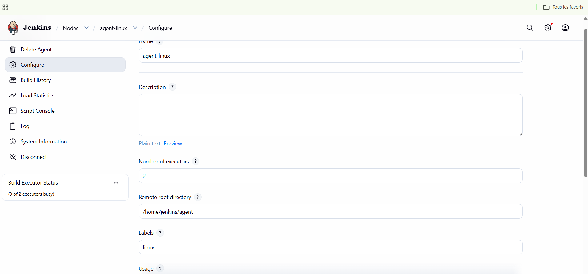
  *Légende : Paramètres de connexion SSH.*

- **Figure 46 : Détails de configuration agent 2**
  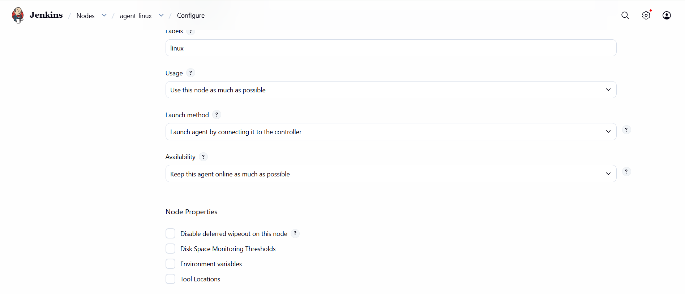
  *Légende : Gestion des executors et des labels.*

---

## TP10 – Sécurité, Sauvegarde et Restauration

### Objectif officiel
Sécuriser l'instance Jenkins et mettre en place une stratégie de sauvegarde robuste.

### Manipulations réalisées
- **Sécurité :** Activation de la base d'utilisateurs interne et mise en place d'une "Matrix-based security". Création des comptes `admin`, `dev` (droits de build) et `reader` (lecture seule).
- **Sauvegarde :** Installation du plugin `ThinBackup`. Configuration du répertoire de sauvegarde et planification de sauvegardes complètes (incluant les jobs, plugins et configurations).

### Analyse des captures
- **Figure 47 : Création des comptes utilisateurs**
  
  *Légende : Gestion de la base utilisateur Jenkins.*

- **Figure 48 : Sauvegarde automatique**
  
  *Légende : Configuration du plugin de backup.*

- **Figure 49 : Compte utilisateur Développeur**
  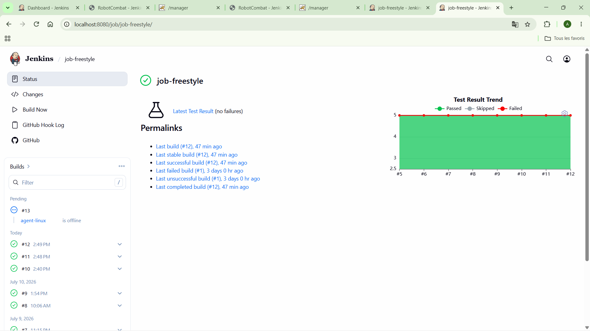
  *Légende : Attribution des droits pour les développeurs.*

- **Figure 50 : Compte utilisateur Lecteur**
  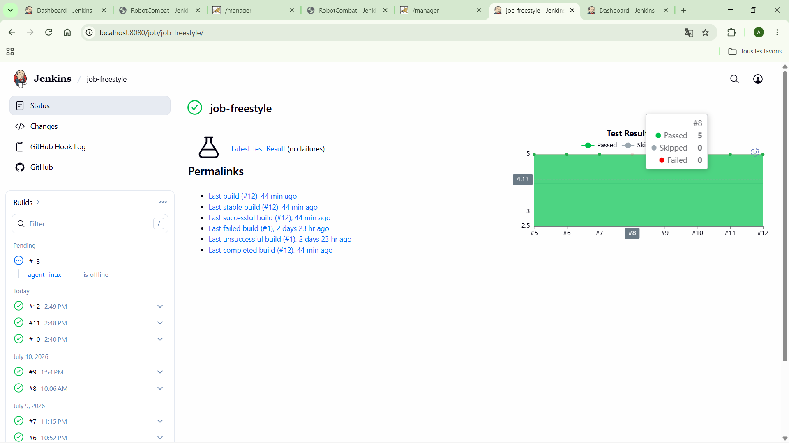
  *Légende : Attribution des droits en lecture seule.*

- **Figure 51 : Vérification du compte Reader**
  
  *Légende : Interface restreinte pour l'utilisateur reader.*

### Résultats et Conclusion
L'instance est désormais protégée contre les accès non autorisés et les pertes de données. La restauration a été testée avec succès en simulant une suppression de configuration.

---

## Difficultés rencontrées

Durant ces travaux pratiques, plusieurs obstacles techniques ont été surmontés :

1. **Problèmes de connexion SSH (TP9) :**
   - *Problème :* Impossible pour le maître de se connecter à l'agent Docker.
   - *Analyse :* Les clés SSH n'étaient pas correctement injectées dans le conteneur agent.
   - *Solution :* Utilisation des credentials de type "SSH Username with private key" et vérification des permissions sur l'agent.
   - *Résultat :* Connexion établie et agent opérationnel.

2. **Configuration réseau Docker (TP4/TP6) :**
   - *Problème :* Jenkins ne parvenait pas à joindre SonarQube ou Tomcat via `localhost`.
   - *Analyse :* Dans un réseau Docker, chaque conteneur a sa propre boucle locale.
   - *Solution :* Utilisation du nom du conteneur dans les URLs (ex: `http://sonarqube:9000`) après avoir placé tous les conteneurs sur le même réseau Docker.

3. **Gestion des permissions ThinBackup (TP10) :**
   - *Problème :* Le plugin ne parvenait pas à écrire les sauvegardes sur le volume monté.
   - *Analyse :* Droits d'écriture insuffisants pour l'utilisateur `jenkins` sur le dossier hôte.
   - *Solution :* Commande `chown -R 1000:1000` sur le répertoire de backup.

---

## Bonnes pratiques DevOps appliquées

- **Pipeline as Code :** Utilisation systématique du `Jenkinsfile` pour assurer la traçabilité.
- **Gestion des credentials :** Aucune donnée sensible (mot de passe, token) n'a été codée en dur.
- **Séparation Contrôleur/Agent :** Isolation des builds pour protéger l'intégrité du serveur maître.
- **Qualité logicielle :** Utilisation de SonarQube pour empêcher la dette technique de s'accumuler.
- **Infrastructure as Code (via Docker) :** Déploiement reproductible de l'ensemble de l'environnement technique.

---

## Bilan général

Cette formation m'a permis d'acquérir une expertise solide sur l'outil Jenkins et son intégration dans une chaîne DevOps moderne. Les compétences acquises incluent :
- La maîtrise de l'installation et de la configuration de **Jenkins via Docker**.
- L'automatisation complète des cycles de production avec **Maven et GitHub**.
- La garantie de la qualité logicielle avec **SonarQube**.
- La mise en œuvre du **Déploiement Continu sur Tomcat**.
- La gestion avancée de la sécurité, de la haute disponibilité (Agents) et des sauvegardes.

Ces acquis constituent une base fondamentale pour toute démarche de transformation DevOps en entreprise.

---
*Fin du rapport*
